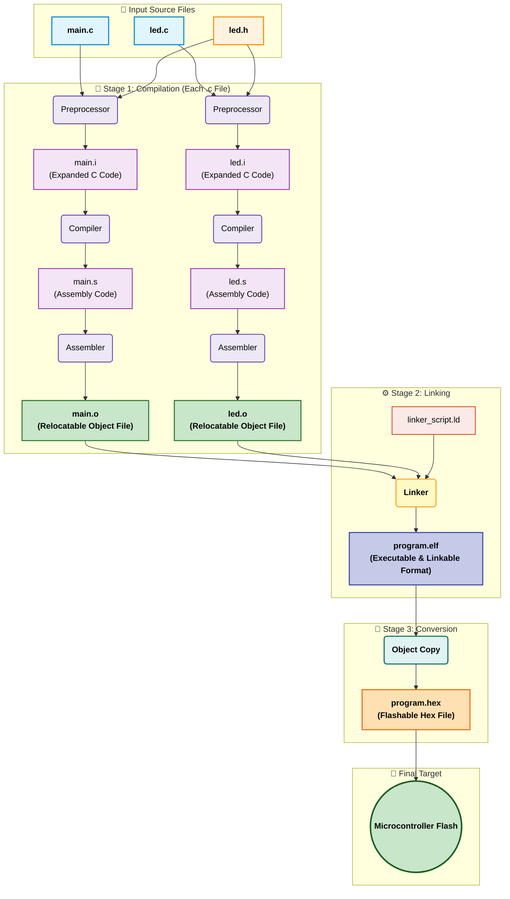

# Demystifying the Embedded C Build Process

## 1. Introduction

This repository documents the step-by-step process of converting C source code into an executable binary for an embedded target, **entirely from the command line**. The primary objective is to build and analyze each stage of the compilation toolchain manually, without the abstraction of an Integrated Development Environment (IDE).

By executing each tool (preprocessor, compiler, assembler, linker) individually, I demonstrate the precise flow of transformations a program undergoes—from human-readable `.c` files to machine-specific `.hex` files. This project serves as a practical exploration of compiler mechanics, file formats (ELF, HEX), and build automation using Makefiles.

The analysis is performed using the **GNU ARM Embedded Toolchain**, a standard in professional embedded systems development.

---

## 2. The Build Process: From `.c` to `.hex`

The journey from a source file to a format a microcontroller can execute involves several distinct stages. The entire set of tools that performs these conversions is known as the **Toolchain**. The following diagram illustrates this standard flow.

# Demystifying the Embedded C Build Process

## 1. Introduction

This repository documents the step-by-step _ process of converting C source code into an executable binary for an embedded target_ , **entirely from the command line**. The primary objective is to build and analyze each stage of the compilation toolchain manually, without the abstraction of an Integrated Development Environment (IDE).

By executing each tool (preprocessor, compiler, assembler, linker) individually, I demonstrate the precise flow of transformations a program undergoes—from human-readable `.c` files to machine-specific `.hex` files. This project serves as a practical exploration of compiler mechanics, file formats (ELF, HEX), and build automation using Makefiles.

The analysis is performed using the **GNU ARM Embedded Toolchain**, a standard in professional embedded systems development.

---

## 2. The Build Process: From `.c` to `.hex`

The journey from a source file to a format a microcontroller can execute involves several distinct stages. The entire set of tools that performs these conversions is known as the **Toolchain**. The following diagram illustrates this standard flow.

