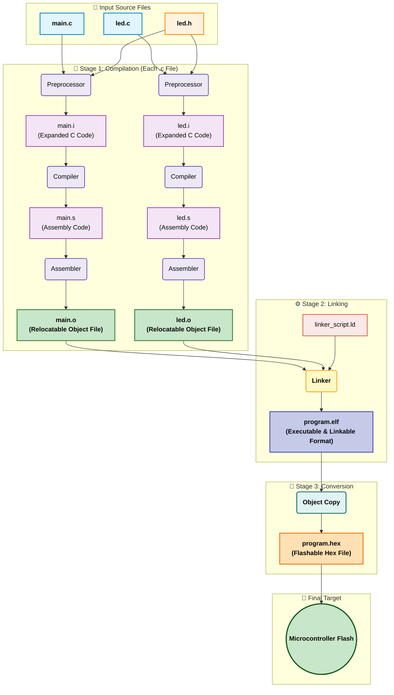
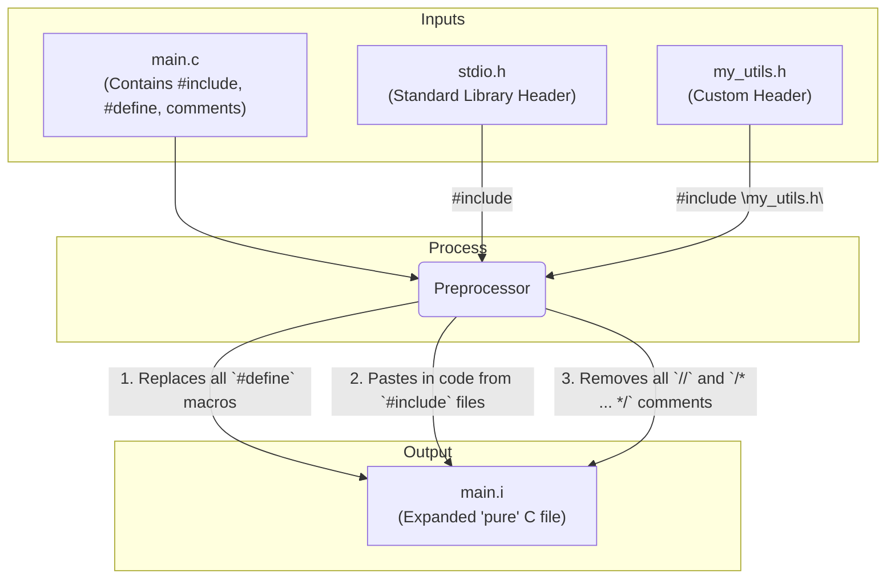
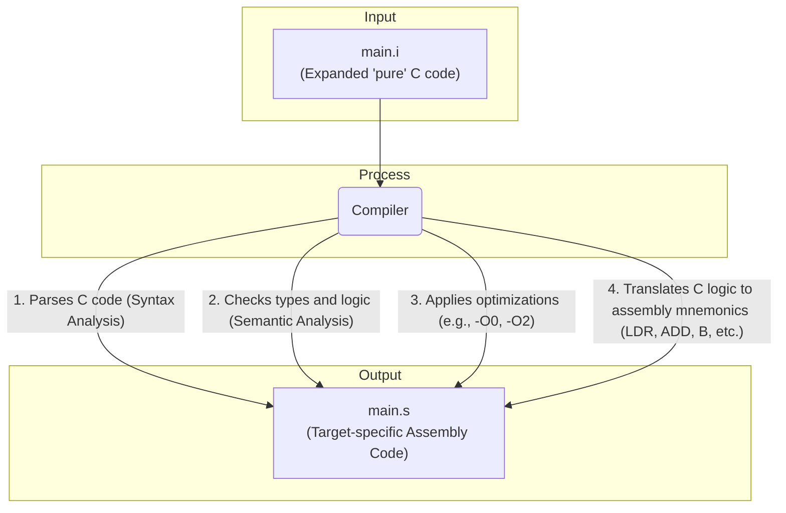
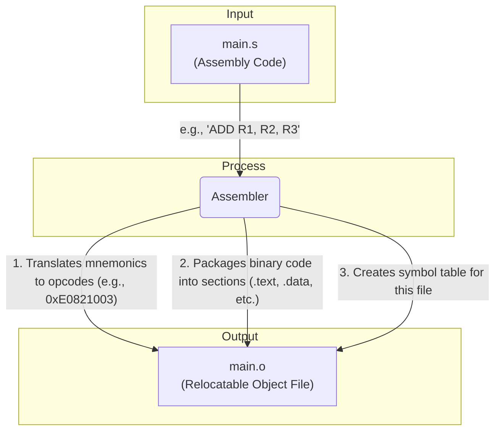
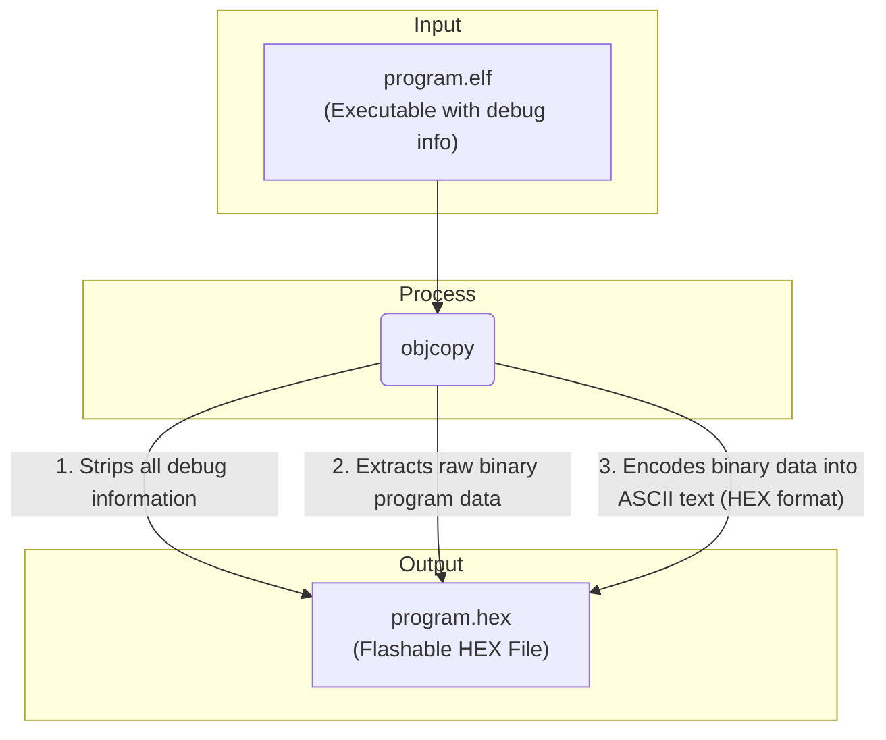

# Demystifying the Embedded C Build Process

## 1. Introduction

This repository documents the step-by-step process of converting C source code into an executable binary for an embedded target, **entirely from the command line**. The primary objective is to build and analyze each stage of the compilation toolchain manually, without the abstraction of an Integrated Development Environment (IDE).

By executing each tool (preprocessor, compiler, assembler, linker) individually, I demonstrate the precise flow of transformations a program undergoes—from human-readable `.c` files to machine-specific `.hex` files. This project serves as a practical exploration of compiler mechanics, file formats (ELF, HEX), and build automation using Makefiles.

The analysis is performed using the **GNU ARM Embedded Toolchain**, a standard in professional embedded systems development.

---

## 2. The Build Process: From `.c` to `.hex`

The journey from a source file to a format a microcontroller can execute involves several distinct stages. The entire set of tools that performs these conversions is known as the **Toolchain**. The following diagram illustrates this standard flow.

# Demystifying the Embedded C Build Process

## 1. Introduction

This repository documents the step-by-step _ process of converting C source code into an executable binary for an embedded target_ , **entirely from the command line**. The primary objective is to build and analyze each stage of the compilation toolchain manually, without the abstraction of an Integrated Development Environment (IDE).

By executing each tool (preprocessor, compiler, assembler, linker) individually, I demonstrate the precise flow of transformations a program undergoes—from human-readable `.c` files to machine-specific `.hex` files. This project serves as a practical exploration of compiler mechanics, file formats (ELF, HEX), and build automation using Makefiles.

The analysis is performed using the **GNU ARM Embedded Toolchain**, a standard in professional embedded systems development.

---

## 2. The Build Process: From `.c` to `.hex`

The journey from a source file to a format a microcontroller can execute involves several distinct stages. The entire set of tools that performs these conversions is known as the **Toolchain**. The following diagram illustrates this standard flow.

---

## 3. Core Concepts

### 3.1. The Build Stages Explained

1.  **Preprocessing (`.c` -> `.i`):** The preprocessor is a text-based tool. It scans the C file for directives (lines starting with `#`). Its primary jobs are to copy-paste the contents of `#include` files, replace all `#define` macros, and remove all comments. The output is a single, large, "pure" C file with the `.i` extension.

2.  **Compilation (`.i` -> `.s`):** The compiler parses the preprocessed C code. It checks for syntax errors, performs optimizations (like `-O0` or `-O2`), and translates the C logic into processor-specific **Assembly Language**. The output is a human-readable assembly file with the `.s` extension.

3.  **Assembling (`.s` -> `.o`):** The assembler translates the human-readable assembly mnemonics (like `LDR`, `STR`, `B`) into raw binary machine code. It packages this code, along with metadata, into a **Relocatable Object File** (`.o`). This file is "relocatable" because it contains code and data, but it has no assigned final memory addresses.

4.  **Linking (`.o` -> `.elf`):** The linker is the final builder. Its job is to take all the separate `.o` files and "link" them together into a single file. It performs two critical tasks:
    * **Symbol Resolution:** It finds where functions or variables are defined. If `main.o` calls a function `led_on()`, the linker finds the machine code for `led_on()` inside `led.o` and connects the call.
    * **Relocation:** It uses a **Linker Script** (`.ld`)—our memory map—to assign final, absolute memory addresses to all the code and data. It places the `.text` (code) sections into Flash memory and the `.data` (variables) sections into RAM, according to the microcontroller's specific memory layout. The output is a single **Executable and Linkable Format (`.elf`)** file.

5.  **Conversion (`.elf` -> `.hex`):** The `.elf` file contains a lot of extra information used for debugging. A microcontroller's flash memory only needs the raw program data. The `objcopy` utility extracts this raw data and formats it into a standard, text-based `.hex` file (Intel HEX format), which the programming hardware uses to flash the chip.

### 3.2. Cross-Compilation

This entire process is performed using a **Cross-Compiler**. A native compiler runs on one architecture (like x86) and creates a program for that same architecture (x86).

An embedded toolchain is a cross-compiler. It **runs** on a host PC (e.g., a 64-bit Windows machine) but **generates** machine code for a completely different target architecture (e.g., a 32-bit ARM Cortex-M4). This is essential, as the microcontroller itself lacks the resources to host and run a compiler.

