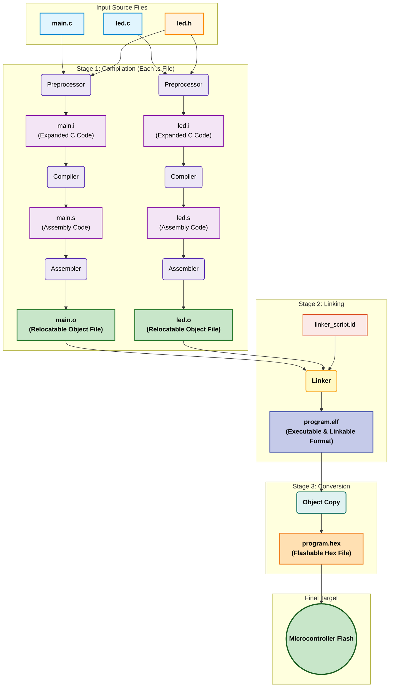
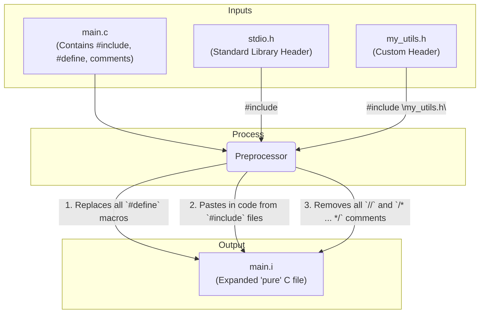
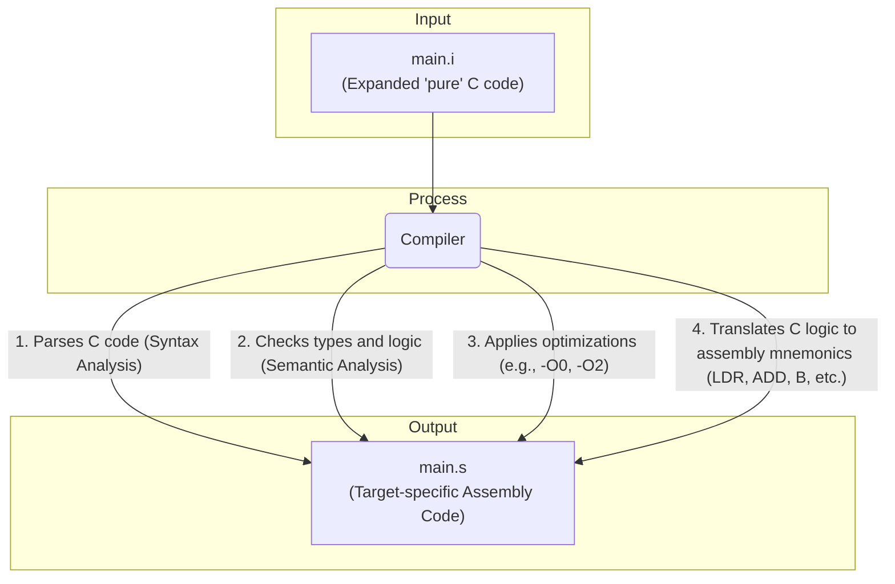
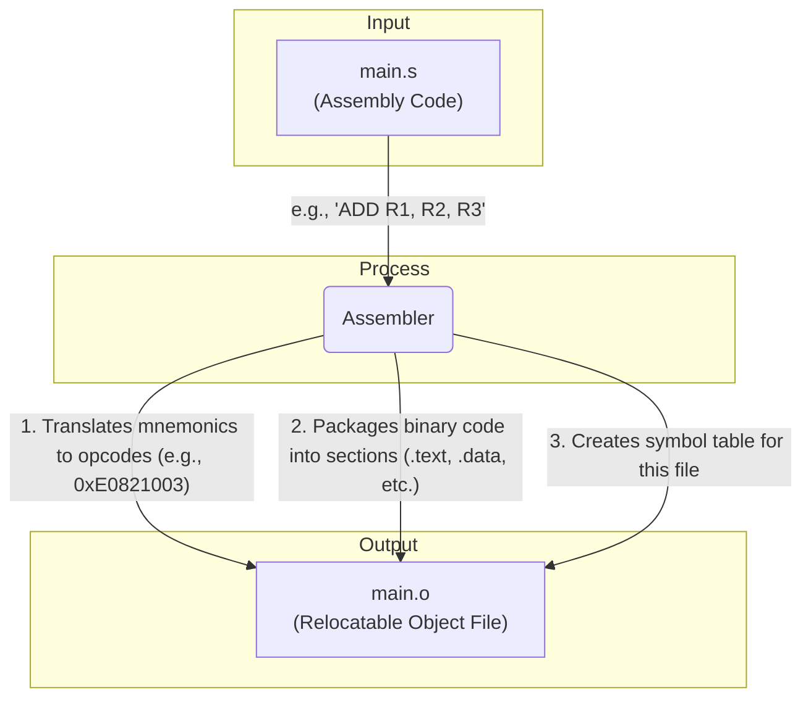
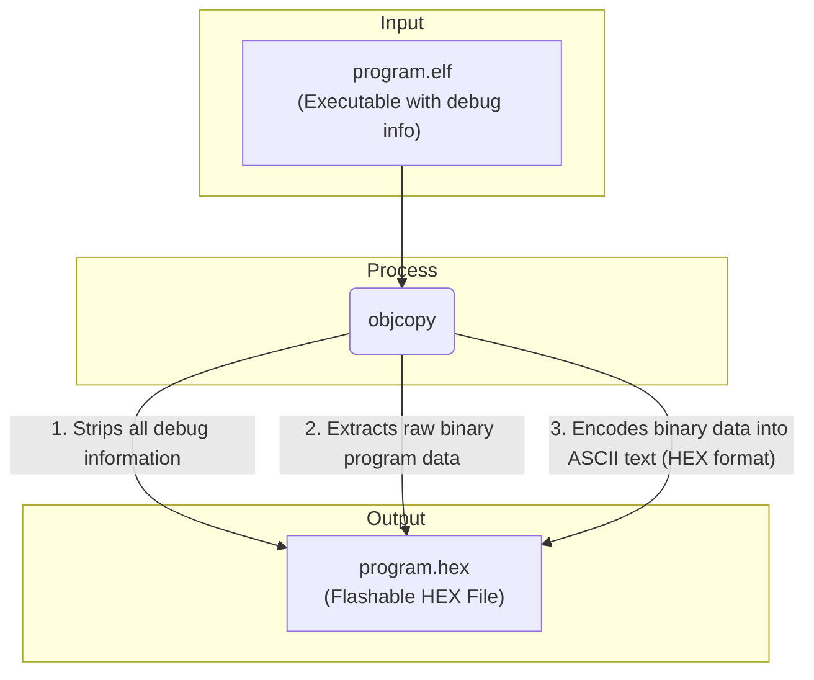

# Demystifying the Embedded C Build Process

## Table of Contents

1.  [Introduction](#1-introduction)
2.  [The Build Process: From .c to .hex](#2-the-build-process-from-c-to-hex)
3.  [Core Concepts](#3-core-concepts)
    * [3.1. The Build Stages Explained](#31-the-build-stages-explained)
    * [3.2. Cross-Compilation](#32-cross-compilation)
4.  [The GNU ARM Toolchain](#4-the-gnu-arm-toolchain)
    * [4.1. Primary Build Tools](#41-primary-build-tools)
    * [4.2. Binary Analysis Utilities](#42-binary-analysis-utilities)
    * [4.3. Format Converter](#43-format-converter)
5.  [Practical Build Walkthrough (ARM)](#5-practical-build-walkthrough)
    * [5.1. The Compilation Step (.c -> .o)](#51-the-compilation-step-c---o)
    * [5.2. Analyzing the Assembly File (.s)](#52-analyzing-the-assembly-file-s)
6.  [Analyzing the Object File](#6-analyzing-the-object-file)
    * [6.1. Example Output After Linking (program.elf)](#61-example-output-after-linking-programelf)
7.  [Automating the Build with `make`](#7-automating-the-build-with-make)
    * [7.1. Sample Makefile](#71-sample-makefile)
    * [7.2. Makefile Variable Explanation](#72-makefile-variable-explanation)
    * [7.3. Makefile Rule Explained](#73-makefile-rule-explained)
8.  [The Compiler: `arm-none-eabi-gcc`](#8-the-compiler-arm-none-eabi-gcc)
9.  [Bare-Metal Arduino Uno (AVR)](#9-case-study-bare-metal-arduino-uno-avr)
    

## 1. Introduction

This repository documents the step-by-step _process of converting C source code into an executable binary for an embedded target_ , **entirely from the command line**. The primary objective is to build and analyze each stage of the compilation toolchain manually, without the abstraction of an Integrated Development Environment (IDE).

By executing each tool (preprocessor, compiler, assembler, linker) individually, I demonstrate the precise flow of transformations a program undergoes—from human-readable `.c` files to machine-specific `.hex` files. This project serves as a practical exploration of compiler mechanics, file formats (ELF, HEX), and build automation using Makefiles.

The analysis is performed using the **GNU ARM Embedded Toolchain**, a standard in professional embedded systems development.

---

## 2. The Build Process: From `.c` to `.hex`

The journey from a source file to a format a microcontroller can execute involves several distinct stages. The entire set of tools that performs these conversions is known as the **Toolchain**. The following diagram illustrates this standard flow.




---

## 3. Core Concepts

### 3.1. The Build Stages Explained

1.  **Preprocessing (`.c` -> `.i`):** The preprocessor is a text-based tool. It scans the C file for directives (lines starting with `#`). Its primary jobs are to copy-paste the contents of `#include` files, replace all `#define` macros, and remove all comments. The output is a single, large, "pure" C file with the `.i` extension.



2.  **Compilation (`.i` -> `.s`):** The compiler parses the preprocessed C code. It checks for syntax errors, performs optimizations (like `-O0` or `-O2`), and translates the C logic into processor-specific **Assembly Language**. The output is a human-readable assembly file with the `.s` extension.



3.  **Assembling (`.s` -> `.o`):** The assembler translates the human-readable assembly mnemonics (like `LDR`, `STR`, `B`) into raw binary machine code. It packages this code, along with metadata, into a **Relocatable Object File** (`.o`). This file is "relocatable" because it contains code and data, but it has no assigned final memory addresses.


4.  **Linking (`.o` -> `.elf`):** The linker is the final builder. Its job is to take all the separate `.o` files and "link" them together into a single file. It performs two critical tasks:
    * **Symbol Resolution:** It finds where functions or variables are defined. If `main.o` calls a function `led_on()`, the linker finds the machine code for `led_on()` inside `led.o` and connects the call.
    * **Relocation:** It uses a **Linker Script** (`.ld`)—our memory map—to assign final, absolute memory addresses to all the code and data. It places the `.text` (code) sections into Flash memory and the `.data` (variables) sections into RAM, according to the microcontroller's specific memory layout. The output is a single **Executable and Linkable Format (`.elf`)** file.


5.  **Conversion (`.elf` -> `.hex`):** The `.elf` file contains a lot of extra information used for debugging. A microcontroller's flash memory only needs the raw program data. The `objcopy` utility extracts this raw data and formats it into a standard, text-based `.hex` file (Intel HEX format), which the programming hardware uses to flash the chip.



### 3.2. Cross-Compilation

This entire process is performed using a **Cross-Compiler**. A native compiler runs on one architecture (like x86) and creates a program for that same architecture (x86).

An embedded toolchain is a cross-compiler. It **runs** on a host PC (e.g., a 64-bit Windows machine) but **generates** machine code for a completely different target architecture (e.g., a 32-bit ARM Cortex-M4). This is essential, as the microcontroller itself lacks the resources to host and run a compiler.

## 4. The GNU ARM Toolchain

The **[GNU Arm Embedded Toolchain](https://developer.arm.com/downloads/toolchains/gnu-arm-embedded)** is a free, open-source collection of tools for C/C++ development for ARM processors. The toolchain is a set of command-line binaries, each with a specific job. The prefix `arm-none-eabi-` tells us:

* **`arm`**: The target architecture is ARM.
* **`none`**: It does not target a specific operating system (i.e., it's "bare-metal").
* **`eabi`**: It adheres to the Embedded Application Binary Interface, a standard for how functions are called, how data is structured, etc.

### 4.1. Primary Build Tools

* **[`arm-none-eabi-gcc`](https://gcc.gnu.org/onlinedocs/gcc/index.html) (GNU Compiler Collection):** This is the main "driver." It's a high-level tool that automatically calls the preprocessor, compiler, and assembler. It can also invoke the linker, making it the primary tool we interact with.
* **[`arm-none-eabi-as`](https://sourceware.org/binutils/docs/as/) (Assembler):** This tool specifically translates `.s` assembly files into `.o` object files. It is usually called by `gcc` in the background.
* **[`arm-none-eabi-ld`](https://sourceware.org/binutils/docs/ld/) (Linker):** This is the powerful linker responsible for combining all `.o` files into the final `.elf` file, guided by the linker script. `gcc` also calls this in the background during the final linking step.

### 4.2. Binary Analysis Utilities

These tools are not for *building* the code, but for *analyzing* the files we build. They are part of the GNU Binutils package. (See **[Official Binutils Documentation](https://sourceware.org/binutils/docs/binutils/)**)

* **`arm-none-eabi-objdump`:** "Object Dump." This is the most versatile tool for inspecting binary files. It can disassemble the machine code back into assembly, display the symbol table, and show all the section headers (like `.text`, `.data`, `.bss`).
* **`arm-none-eabi-nm`:** Lists all the **symbols** (functions and global variables) in an object file, showing their addresses and where they are defined.
* **`arm-none-eabi-readelf`:** Provides a highly detailed analysis of an `.elf` file, showing its structure, headers, and metadata.

### 4.3. Format Converter

* **`arm-none-eabi-objcopy`:** "Object Copy." This utility is used to transform and copy object files. Its most important job is to convert the final `.elf` file into a flashable `.hex` or `.bin` (binary) file by stripping out debug information and extracting only the program data.

---

## 5. Practical Build Walkthrough

Here I demonstrate the compilation stage on a sample `main.c` file using the commands executed in my terminal.

### 5.1. The Compilation Step (`.c` -> `.o`)

This command runs the preprocessor, compiler, and assembler all at once.

```powershell
PS C:\Users\Desktop\buildprocess> arm-none-eabi-gcc -c -mcpu=cortex-m4 -mthumb main.c -o main.o
```
**Command Breakdown:**

* **`arm-none-eabi-gcc`**: The cross-compiler.
* **`-c`**: This is the most important flag. It tells `gcc` to "Compile and assemble, but do not link." It takes the `.c` file and stops at the `.o` (object file) stage.
* **`-mcpu=cortex-m4`**: Specifies the exact target processor. The compiler will generate machine code optimized for the Cortex-M4 CPU. (This is a machine-dependent option).
* **`-mthumb`**: Tells the compiler to generate "Thumb" instructions. This is a 16/32-bit instruction set used by ARM microcontrollers to produce smaller, more efficient code.
* **`main.c`**: The input source file.
* **`-o main.o`**: The output file, named `main.o`.

After running this, a `main.o` file is created, as seen in the file list:

```powershell
PS C:\Users\shravana HS\Desktop\buildprocess> ls

    Directory: C:\Users\shravana HS\Desktop\buildprocess

Mode                LastWriteTime         Length Name
----                -------------         ------ ----
-a----       02-11-2025     15:14           1127 led.c
-a----       02-11-2025     15:14            521 led.h
-a----       02-11-2025     15:14           8388 main.c
-a----       02-11-2025     15:14           1344 main.h
-a----       02-11-2025     15:25           4544 main.o   <-- Our new file
-a----       02-11-2025     15:14            650 stm32_ls.ld
-a----       0_d2-11-2025     15:14          11769 stm32_startup.c
-a----       02-11-2025     15:14           4943 syscalls.c
```

### 5.2. Analyzing the Assembly File (`.s`)

After running the `-S` flag, the `main.s` file is created. This file is a human-readable text file containing the ARM assembly code generated by the compiler.

```powershell
PS C:\Users\shravana HS\Desktop\buildprocess> arm-none-eabi-gcc -S -mcpu=cortex-m4 -mthumb main.c -o main.s

PS C:\Users\shravana HS\Desktop\buildprocess> ls

    Directory: C:\Users\shravana HS\Desktop\buildprocess

Mode                LastWriteTime         Length Name
----                -------------         ------ ----
-a----       02-11-2025     15:14           1127 led.c
-a----       02-11-2025     15:14            521 led.h
-a----       02-11-2025     15:14           8388 main.c
-a----       02-11-2025     15:14           1344 main.h
-a----       02-11-2025     15:25           4544 main.o
-a----       02-11-2025     15:30          25410 main.s   <-- Our new file
-a----       02-11-2025     15:14            650 stm32_ls.ld
-a----       02-11-2025     15:14          11769 stm32_startup.c
-a----       02-11-2025     15:14           4943 syscalls.c
```
Here is a small, annotated snippet from the `main.s` file, showing the `task1_handler` function. This demonstrates how C code is translated into low-level mnemonics.

**Assembly Snippet (`main.s`):**
```assembly
	.section	.rodata
	.align	2
.LC1:
	.ascii	"Task1 is executing\000"
	.text
	.align	1
	.global	task1_handler
	.syntax unified
	.thumb
	.thumb_func
	.type	task1_handler, %function
task1_handler:
	@ args = 0, pretend = 0, frame = 0
	@ frame_needed = 1, uses_anonymous_args = 0
	push	{r7, lr}
	add	r7, sp, #0
.L8:
	ldr	r0, .L9
	bl	puts
	movs	r0, #12
	bl	led_on
	mov	r0, #1000
	bl	task_delay
	movs	r0, #12
	bl	led_off
	mov	r0, #1000
	bl	task_delay
	b	.L8
.L10:
	.align	2
.L9:
	.word	.LC1
```

This assembly snippet defines the task1_handler function, using directives like .section to separate read-only data (.rodata) from code (.text). It uses labels like task1_handler: to mark the function's start and .L8: to create the infinite while(1) loop. The code loads arguments into register r0 using ldr (for the string address) and movs (for immediate numbers like 12). Finally, it calls other C functions like puts and led_on using the bl (Branch with Link) instruction, and loops indefinitely with the b .L8 instruction.

---

## 6. Analyzing the Object File

The `main.o` file is in **ELF (Executable and Linkable Format)**. This is a standard format for object files and executables that organizes the program into different sections. It's "relocatable" because its code and data don't have final, absolute addresses.

To analyze this file, I use `arm-none-eabi-objdump`.

```powershell
PS C:\...\buildprocess> arm-none-eabi-objdump -h main.o
```

* **`-h`**: This flag tells `objdump` to display the "section headers" of the file.

The output shows the different sections inside the object file.

```
main.o:     file format elf32-littlearm

Sections:
Idx Name          Size      VMA       LMA       File off  Algn
  0 .text         0000053c  00000000  00000000  00000034  2**2
                  CONTENTS, ALLOC, LOAD, RELOC, READONLY, CODE
  1 .data         00000001  00000000  00000000  00000570  2**0
                  CONTENTS, ALLOC, LOAD, DATA
  2 .bss          00000054  00000000  00000000  00000574  2**2
                  ALLOC
  3 .rodata       000000c9  00000000  00000000  00000574  2**2
                  CONTENTS, ALLOC, LOAD, READONLY, DATA
  4 .debug_info   00000472  00000000  00000000  0000063d  2**0
                  CONTENTS, RELOC, READONLY, DEBUGGING, OCTETS
  5 .debug_abbrev 00000232  00000000  00000000  00000aaf  2**0
                  CONTENTS, READONLY, DEBUGGING, OCTETS
  6 .debug_aranges 00000020  00000000  00000000  00000ce1  2**0
                  CONTENTS, RELOC, READONLY, DEBUGGING, OCTETS
  7 .debug_line   0000031e  00000000  00000000  00000d01  2**0
                  CONTENTS, RELOC, READONLY, DEBUGGING, OCTETS
  8 .debug_str    000003ce  00000000  00000000  0000101f  2**0
                  CONTENTS, READONLY, DEBUGGING, OCTETS
  9 .comment      00000047  00000000  00000000  000013ed  2**0
                  CONTENTS, READONLY
 10 .debug_frame  000002d8  00000000  00000000  00001434  2**2
                  CONTENTS, RELOC, READONLY, DEBUGGING, OCTETS
 11 .ARM.attributes 0000002e  00000000  00000000  0000170c  2**0
                  CONTENTS, READONLY
```

The most important sections for our program logic are:

* **`.text`**: This section contains the actual binary machine code for the functions (e.g., your `main` function).
* **`.data`**: This contains global or static variables that are initialized with a non-zero value (e.g., `int my_var = 100;`).
* **`.bss`**: This section holds *uninitialized* global or static variables (e.g., `int my_buffer[10];`). The `.elf` file just records *how much space* this section needs; the startup code will fill it with zeros in RAM.
* **`.rodata`**: "Read-Only Data." This is for constant data that won't change, like string literals (e.g., `const char* my_string = "Hello";`).

Notice the `VMA` (Virtual Memory Address) for all sections is `00000000`. This confirms these sections are "relocatable." The linker's job is to collect all these sections from all `.o` files and place them at the correct absolute addresses in the final `.elf` file.

### 6.1. Example Output After Linking (`program.elf`)

After linking all the `.o` files (which I will show in a later step), I would run `arm-none-eabi-objdump -h program.elf`. The output would look something like this. Notice the **VMA** (Virtual Memory Address) column is no longer zero, as the linker has now assigned all the final memory addresses.
**Analysis of the Linked File:**
```
program.elf:     file format elf32-littlearm

Sections:
Idx Name          Size      VMA       LMA       File off  Algn
  0 .text         00000a2c  08000000  08000000  00001000  2**2
                  CONTENTS, ALLOC, LOAD, READONLY, CODE
  1 .rodata       000001bc  08000a2c  08000a2c  00001a2c  2**2
                  CONTENTS, ALLOC, LOAD, READONLY, DATA
  2 .data         00000008  20000000  08000be8  00001be8  2**2
                  CONTENTS, ALLOC, LOAD, DATA
  3 .bss          000000a8  20000008  08000bf0  00001bf0  2**2
                  ALLOC
  4 .debug_info   00003b7c  00000000  00000000  00001bf0  2**0
                  CONTENTS, READONLY, DEBUGGING, OCTETS
  5 .debug_abbrev 00000a12  00000000  00000000  0000576c  2**0
                  CONTENTS, READONLY, DEBUGGING, OCTETS
... (other debug sections) ...
```
The key difference is that the `VMA` and `LMA` columns are now filled in based on the microcontroller's memory map (from the `stm32_ls.ld` linker script):

* **`.text` (Code):**
    * **VMA/LMA: `08000000`**
    * This is the starting address of Flash memory on an STM32 chip. The linker has placed our code here.

* **`.rodata` (Read-Only Data):**
    * **VMA/LMA: `08000a2c`**
    * The linker has placed the constant data in Flash immediately after the `.text` section.

* **`.data` (Initialized Variables):**
    * **VMA: `20000000`**
    * This is the starting address of **RAM**. The program will *use* this variable in RAM.
    * **LMA: `08000be8`**
    * This is the "Load Address." It's in **Flash**. This tells the startup code: "When the chip boots, go to address `0x08000be8` in Flash, copy the `0x00000008` bytes of data you find there, and paste them into RAM at address `20000000`."

* **`.bss` (Uninitialized Variables):**
    * **VMA: `20000008`**
    * This section is also in **RAM**, right after `.data`.
    * Notice it has **no LMA** and a zero `File off`. That's because it's not loaded from Flash. The startup code simply "clears" this 0xa8-byte-sized block of RAM to zeros.


  ---

## 7. Automating the Build with `make`

Typing these commands for every file is repetitive and error-prone. The `make` utility automates this entire process. It reads a special file named `Makefile` that defines the rules, dependencies, and commands required to build the project.

### 7.1. Sample Makefile

This is a simple `Makefile` to compile `main.c` into `main.o`.

```makefile
CC=arm-none-eabi-gcc
MACHINE=cortex-m4
# NOTE: -O0 (letter O, zero) is for optimization level 0 (none)
# -std=gnu11 is a common C standard
CFLAGS= -c -mcpu=$(MACHINE) -mthumb -std=gnu11 -O0

main.o: main.c
	$(CC) $(CFLAGS) $^ -o $@
```
## 🧩 Makefile Variable Explanation

```makefile
CC = arm-none-eabi-gcc
```
Defines a variable named CC to hold the name of our compiler.

```makefile
MACHINE = cortex-m4
```
Defines a variable MACHINE for our CPU type.

```makefile
CFLAGS = ...
```
Defines a variable CFLAGS to hold all compiler flags.

```makefile
$(MACHINE)
```
This is how we reference the MACHINE variable inside another variable.

```makefile

-O0
```
Sets the optimization level to 0 (no optimization) — best for debugging.

## ⚙️ Rule Example

```makefile
main.o: main.c
	$(CC) $(CFLAGS) $^ -o $@
```
## ⚙️ Rule Explanation

This is a **Rule**.

**main.o:** The **Target** (the file we want to build).  
**main.c:** The **Dependency** (the file needed to build the target).  
**$(CC) $(CFLAGS) $^ -o $@:** This is the **Command** to run.  

**$(CC)** and **$(CFLAGS):** Use our defined variables.  
**$^:** An automatic variable in make that means **"all dependencies"** (in this case, *main.c*).  
**$@:**
An automatic variable in make that means **"the target"** (in this case, *main.o*).  

When you run **make** in the terminal, make finds the **main.o** rule, sees that it depends on **main.c**, and (if **main.c** is newer than **main.o**) it will execute the command:
```
arm-none-eabi-gcc -c -mcpu=cortex-m4 -mthumb -std=gnu11 -O0 main.c -o main.o
```

## 8. The Compiler: `arm-none-eabi-gcc`

The compiler we defined in our `Makefile` (`CC=arm-none-eabi-gcc`) is a specific version of the **GNU Compiler Collection (GCC)**. This is a **cross-compiler**, which means it runs on one machine (like your x86 PC) but generates machine code for a different type of machine (our ARM microcontroller).

Let's break down its name:

* **`arm`**: This compiler specifically targets the **ARM** processor architecture.
* **`none`**: This indicates it's for a "bare-metal" environment. It means the code isn't being built for a specific operating system (like Linux, Windows, etc.). We are running on "none" OS.
* **`eabi`**: This stands for **Embedded Application Binary Interface**. It's a standard that defines the low-level details of how our compiled code works, such as how function calls are made, how data is laid out in memory, and how object files are formatted.
* **`gcc`**: The **GNU Compiler Collection**, the actual compiler program.

This entire package is often called a "toolchain" because it includes not just the compiler (`gcc`) but also other essential tools:

* **`arm-none-eabi-as`**: The assembler.
* **`arm-none-eabi-ld`**: The linker.
* **`arm-none-eabi-objcopy`**: A tool to convert file formats (e.g., from `.elf` to a `.bin` or `.hex` file to flash to the chip).
* **`arm-none-eabi-gdb`**: The GNU Debugger, for debugging your code on the target.

When we use `arm-none-eabi-gcc` to compile and link, it intelligently calls these other tools as needed. For example, in our `Makefile`:

* The command to build `main.o` (with the `-c` flag) primarily uses the compiler.
* The command to build `main.elf` (without the `-c` flag) implicitly calls the **linker (`ld`)** to combine all the object files (`main.o`) and other necessary startup code into a final executable file.

  #!/bin/bash
```
# This script manually duplicates the build process that 'make' automates.


# --- 1. Compilation Stage ---
echo "--- Compiling source files... ---"

# Compile main.c into main.o
arm-none-eabi-gcc -mcpu=cortex-m4 -mthumb -std=gnu11 -O0 -c main.c -o main.o

# Compile uart.c into uart.o
arm-none-eabi-gcc -mcpu=cortex-m4 -mthumb -std=gnu11 -O0 -c uart.c -o uart.o

# Compile system_init.c into system_init.o
arm-none-eabi-gcc -mcpu=cortex-m4 -mthumb -std=gnu11 -O0 -c system_init.c -o system_init.o


# --- 2. Linking Stage ---
echo "--- Linking object files into executable... ---"

# Link all .o files into the final .elf executable
arm-none-eabi-gcc -mcpu=cortex-m4 -mthumb -std=gnu11 -O0 main.o uart.o system_init.o -o main.elf

echo "--- Build complete: main.elf created. ---"


# --- 3. Cleanup Stage ---
echo "--- Cleaning up all build files... ---"

# Remove all the compiled object files and the final executable
rm -f main.o uart.o system_init.o main.elf

echo "--- Cleanup complete. ---"
  ```

